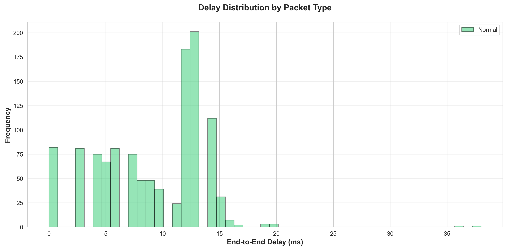

# 📊 Python Analysis Scripts for VANET Packet Delivery

This directory contains Python scripts for analyzing and visualizing packet delivery data from ns-3 VANET simulations.

---

## 📁 Available Scripts

### 1. **analyze_packets.py** - Single Scenario Analysis
Analyzes a single `packet-delivery-analysis.csv` file and generates comprehensive visualizations.

### 2. **compare_scenarios.py** - Multi-Scenario Comparison
Compares multiple CSV files from different scenarios (baseline, attack, mitigation).

---

## 🚀 Quick Start

### Prerequisites

Install required Python packages:

```bash
pip install pandas matplotlib seaborn numpy
```

Or using the requirements file:

```bash
pip install -r requirements.txt
```

---

## 📊 Script 1: Single Scenario Analysis

### Usage:

```bash
# 1. Run simulation with packet tracking
cd /home/kanisa/Downloads/ns-allinone-3.35/ns-3.35
./waf --run "routing --enable_packet_tracking --simTime=10"

# 2. Analyze the generated CSV
python analyze_packets.py
```

### What It Generates:

**📈 Metrics:**
- Total/Delivered/Dropped packets
- Packet Delivery Ratio (PDR)
- Average/Min/Max/Std delay
- Wormhole/Blackhole impact statistics

**📊 Visualizations (7 plots):**
1. `pdr_comparison.png` - PDR for normal vs attack-affected packets
2. `delay_comparison.png` - Delay comparison by packet type
3. `delay_distribution.png` - Histogram of delay distribution
4. `pdr_timeline.png` - PDR over simulation time
5. `attack_impact_pie.png` - Pie charts showing attack impact
6. `communication_matrix.png` - Node-to-node communication heatmap
7. `delay_boxplot.png` - Box plot of delay distributions

**📄 Export Files:**
- `analysis_metrics.csv` - All calculated metrics
- `metrics_table.tex` - LaTeX table for research papers

### Example Output:

```
📊 PACKET DELIVERY ANALYSIS SUMMARY
======================================================================
  Total Packets.......................................... 1250
  Delivered Packets...................................... 1089
  Dropped Packets........................................  161
  Packet Delivery Ratio (%)..............................87.12
  Average Delay (ms).....................................25.43
  Wormhole Affected Packets..............................  315
  Wormhole Impact (%)....................................25.20
======================================================================
```

---

## 🔬 Script 2: Scenario Comparison

### Usage:

```bash
# Step 1: Run baseline (no attack)
./waf --run "routing --use_enhanced_wormhole=false --enable_packet_tracking --simTime=10"
mv packet-delivery-analysis.csv baseline.csv

# Step 2: Run with wormhole attack
./waf --run "routing --enable_packet_tracking --simTime=10"
mv packet-delivery-analysis.csv wormhole_attack.csv

# Step 3: Run with attack + mitigation
./waf --run "routing --enable_wormhole_detection --enable_wormhole_mitigation --enable_packet_tracking --simTime=10"
mv packet-delivery-analysis.csv wormhole_mitigated.csv

# Step 4: Compare all scenarios
python compare_scenarios.py
```

### What It Generates:

**📊 Comparison Plots (5 plots):**
1. `pdr_scenario_comparison.png` - PDR bars for each scenario
2. `delay_scenario_comparison.png` - Delay bars for each scenario
3. `delay_distribution_comparison.png` - Overlaid delay histograms
4. `metrics_radar_comparison.png` - Radar chart with multiple metrics
5. `improvement_percentage.png` - Improvement relative to baseline

**📄 Export Files:**
- `scenario_comparison.csv` - Side-by-side metrics table

### Example Output:

```
📊 SCENARIO COMPARISON
================================================================================

📈 Baseline (No Attack):
   Total Packets........................... 1250
   PDR (%)..................................95.20
   Avg Delay (ms)...........................18.34

📈 Wormhole Attack:
   Total Packets........................... 1250
   PDR (%)..................................73.60
   Avg Delay (ms)...........................45.78

📈 With Mitigation:
   Total Packets........................... 1250
   PDR (%)..................................88.40
   Avg Delay (ms)...........................24.12
================================================================================
```

---

## 📈 Visualization Examples

### PDR Comparison

*Shows PDR for normal, wormhole-affected, and blackhole-affected packets*

### Delay Distribution

*Histogram showing delay distribution by packet type*

### Attack Impact

*Pie charts showing packet distribution and delivery status*

---

## 🎓 Research Paper Integration

### Using Generated Figures

1. **High-quality PNG files** (300 DPI) ready for publication
2. **LaTeX table** automatically generated for metrics
3. **CSV exports** for custom analysis in Excel/R

### LaTeX Integration Example:

```latex
\begin{figure}[htbp]
    \centering
    \includegraphics[width=0.8\textwidth]{plots/pdr_comparison.png}
    \caption{Packet Delivery Ratio comparison between normal and attack-affected packets}
    \label{fig:pdr_comparison}
\end{figure}

\input{metrics_table.tex}
```

---

## 🔧 Customization

### Modify Plot Settings

Edit the scripts to customize:

```python
# Change figure size
plt.rcParams['figure.figsize'] = (12, 8)

# Change color scheme
colors = ['#2ecc71', '#e74c3c', '#3498db']

# Change DPI for higher/lower resolution
plt.savefig('output.png', dpi=300)  # 300 for publication, 150 for preview
```

### Add Custom Metrics

Add to `calculate_metrics()` method:

```python
# Example: Calculate jitter
self.metrics['Jitter (ms)'] = self.df[self.df['Delivered'] == 1]['DelayMs'].std()
```

---

## 📊 Metrics Reference

### Calculated Metrics:

| Metric | Description | Formula |
|--------|-------------|---------|
| **PDR** | Packet Delivery Ratio | (Delivered / Total) × 100% |
| **Average Delay** | Mean end-to-end delay | Mean(DelayMs) for delivered packets |
| **Wormhole Impact** | % of packets through wormhole | (WormholePackets / Total) × 100% |
| **Blackhole Impact** | % of packets through blackhole | (BlackholePackets / Total) × 100% |

---

## 🐛 Troubleshooting

### Issue: "ModuleNotFoundError: No module named 'pandas'"

**Solution:**
```bash
pip install pandas matplotlib seaborn numpy
```

### Issue: "FileNotFoundError: packet-delivery-analysis.csv"

**Solution:**
```bash
# Run simulation first
./waf --run "routing --enable_packet_tracking --simTime=10"
# Then run analysis
python analyze_packets.py
```

### Issue: Empty plots or "No data"

**Solution:**
```bash
# Increase simulation time for more data
./waf --run "routing --enable_packet_tracking --simTime=30"
```

### Issue: "PermissionError" when saving plots

**Solution:**
```bash
# Create plots directory
mkdir -p plots
chmod 755 plots
```

---

## 📚 Directory Structure

```
routing/
├── analyze_packets.py          # Single scenario analysis script
├── compare_scenarios.py         # Multi-scenario comparison script
├── packet-delivery-analysis.csv # Generated from simulation
├── baseline.csv                 # Baseline scenario (optional)
├── wormhole_attack.csv         # Attack scenario (optional)
├── wormhole_mitigated.csv      # Mitigation scenario (optional)
├── plots/                       # Generated visualizations
│   ├── pdr_comparison.png
│   ├── delay_comparison.png
│   ├── delay_distribution.png
│   ├── pdr_timeline.png
│   ├── attack_impact_pie.png
│   ├── communication_matrix.png
│   └── delay_boxplot.png
├── comparison_plots/            # Scenario comparison plots
│   ├── pdr_scenario_comparison.png
│   ├── delay_scenario_comparison.png
│   ├── delay_distribution_comparison.png
│   ├── metrics_radar_comparison.png
│   └── improvement_percentage.png
├── analysis_metrics.csv         # Exported metrics
├── scenario_comparison.csv      # Scenario comparison table
└── metrics_table.tex           # LaTeX table
```

---

## 🎯 Workflow for Research Paper

### Step-by-Step:

1. **Run simulations:**
   ```bash
   # Baseline
   ./waf --run "routing --use_enhanced_wormhole=false --enable_packet_tracking --simTime=30"
   mv packet-delivery-analysis.csv baseline.csv
   
   # Attack
   ./waf --run "routing --enable_packet_tracking --simTime=30"
   mv packet-delivery-analysis.csv attack.csv
   
   # Mitigation
   ./waf --run "routing --enable_wormhole_detection --enable_wormhole_mitigation --enable_packet_tracking --simTime=30"
   mv packet-delivery-analysis.csv mitigated.csv
   ```

2. **Analyze individual scenarios:**
   ```bash
   # Rename files and analyze each
   cp baseline.csv packet-delivery-analysis.csv
   python analyze_packets.py
   mv plots plots_baseline
   ```

3. **Compare scenarios:**
   ```bash
   python compare_scenarios.py
   ```

4. **Use in paper:**
   - Copy plots to paper directory
   - Include metrics_table.tex in LaTeX
   - Reference figures in text
   - Use scenario_comparison.csv for tables

---

## 🆘 Support

For issues or questions:
1. Check the troubleshooting section
2. Review the CSV file structure
3. Ensure simulation completed successfully
4. Check Python package versions

---

## 📝 Citation

If you use these scripts in your research, please cite:

```bibtex
@misc{vanet_analysis_tool,
  title={VANET Packet Delivery Analysis Tool},
  author={Your Name},
  year={2025},
  howpublished={GitHub Repository}
}
```

---

## ✅ Checklist

Before running analysis:
- [ ] Python 3.7+ installed
- [ ] Required packages installed (pandas, matplotlib, seaborn, numpy)
- [ ] Simulation completed successfully
- [ ] CSV file(s) present in directory
- [ ] Write permissions for output directories

Ready to analyze:
- [ ] Run `python analyze_packets.py` for single scenario
- [ ] Run `python compare_scenarios.py` for comparisons
- [ ] Check `plots/` and `comparison_plots/` directories
- [ ] Review generated metrics files

---

**Happy analyzing! 📊🚗🔒**
